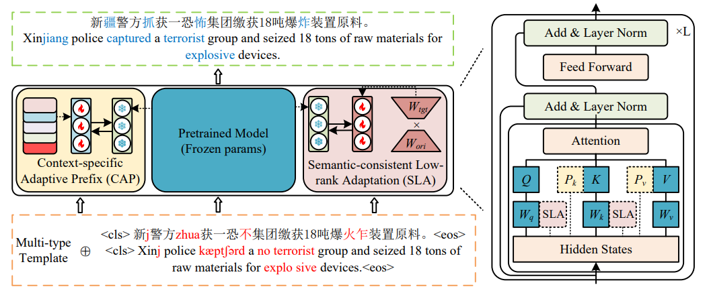

# PROTECT: Parameter-Efficient Tuning for Few-Shot Robust Chinese Text Correction

---

This repository contains code, model, datasets for [PROTECT](https://ieeexplore.ieee.org/document/10557151)



## Pretrain

**dataset**

Pretrain dataset available at [here](https://drive.google.com/file/d/1gWAloeMM2MqC16Vc7j4gv9YjVvcsifQi/view?usp=drive_link) and [Huggingface](https://huggingface.co/fenffef/PROTECT)

```
cd scripts
sh pretrain.sh
```

## Finetune

**pretrained model and datasets**

To facilitate replication, we provide pre-trained PROTECT model and datasets.

pre-trained PROTECT model available at [Huggingface](https://huggingface.co/fenffef/PROTECT)

datasets available at [here](https://drive.google.com/file/d/1gWAloeMM2MqC16Vc7j4gv9YjVvcsifQi/view?usp=drive_link)

```
cd scripts
sh train.sh
```
